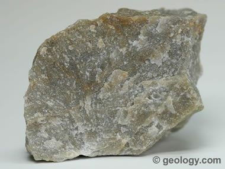
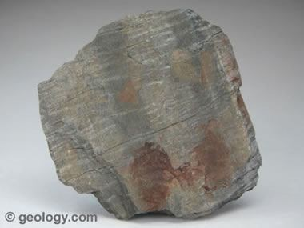
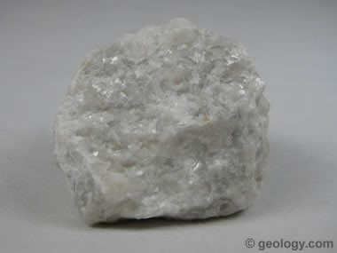
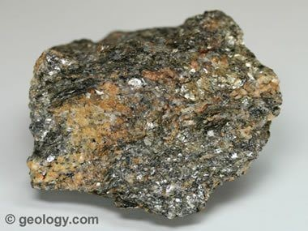
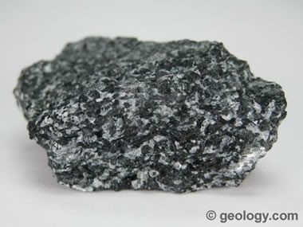
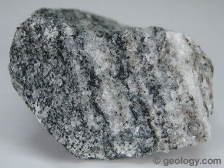

#### Metamorphic Rocks:
Metamorphic Rocks are formed through the transformation of the pre-existing rocks under increased temperature and pressure conditions. This process of transformation is known as Metamorphism. Formation of Metamorphism rock from a pre-existing is controlled by the following parameters Temperature, Pressure, Chemically active fluid these there are known as Metamorphism agents. Generally all these three acts together and cause Metamorphism. But sometimes, any one or two of them any dominate and play together and cause Metamorphism. But sometimes any one or two of them may dominate and play on active role.
 #### Temperature: 
 Changes take place in the temp 350-380˚C.
 Pressure: Uniform pressure increase with depth direct pressure due to tectonic forces
Chemically active fluids: Liquids which acts as carrier of chemical components, volatiles of magma and hydrothermal solutions.
#### Texture
Textures of metamorphic rocks fall into two broad groups, **FOLIATED and NON-FOLIATED.** Foliation is produced in a rock by the parallel alignment of platy minerals (e.g., muscovite, biotite, chlorite), needle-like minerals (e.g., hornblende), or tabular minerals (e.g., feldspars).
**The differences in the orientation, or alignment, of crystals and the size of the crystals** determine the texture of a metamorphic rock. There are two general texture groups. Foliated textures are those in which platy or leaflike minerals such as mica or chlorite are nearly all aligned parallel to one another. 
#### The five basic metamorphic textures with typical rock types are:
- Slaty: slate and phyllite; the foliation is called 'slaty cleavage'
- Schistose: schist; the foliation is called 'schistocity'
- Gneissose: gneiss; the foliation is called 'gneisocity'
- Granoblastic: granulite, some marbles and quartzite. 

 **Quartzite** is a non-foliated metamorphic rock that is produced by the metamorphism of **sandstone**. It is composed primarily of **quartz**. The specimen above is about two inches (five centimeters) across. 

 **Phyllite** is a foliated metamorphic rock that is made up mainly of very fine-grained mica. The surface of phyllite is typically lustrous and sometimes wrinkled. It is intermediate in grade between **slate** and **schist**.  
 
**Marble** is a non-foliated metamorphic rock that is produced from the metamorphism of **limestone** or **dolostone**. It is composed primarily of calcium carbonate. 
  
Schist is a metamorphic rock with well-developed foliation. It often contains significant amounts of mica which allow the rock to split into thin pieces. It is a rock of intermediate metamorphic grade between phyllite and gneiss.
  
**Amphibolite** is a non-foliated metamorphic rock that forms through recrystallization under conditions of high viscosity and directed pressure. It is composed primarily of **hornblende** (amphibole) and **plagioclase**, usually with very little **quartz**. 
  
**Gneiss** is a foliated metamorphic rock that has a banded appearance and is made up of granular mineral grains. It typically contains abundant **quartz** or **feldspar** minerals. 
